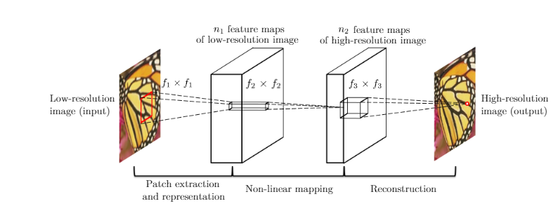

# SRCNN实验报告

## 原理

考虑一个单一低分辨率图像，我们首先使用双三次插值将其放大到所需的大小，这是我们进行的唯一预处理。我们将插值后的图像表示为Y。我们的目标是从Y中恢复出一个图像F(Y)，使其尽可能地与真实高分辨率图像X相似。为了方便表达，我们仍然将Y称为“低分辨率”图像，尽管它的大小与X相同。我们希望学习一个映射F，它在概念上包括三个操作：

1. **Patch提取和表示：** 该操作从低分辨率图像Y中提取（重叠的）补丁，并将每个补丁表示为高维向量。这些向量组成一组特征图，其数量等于向量的维度。

   $$
   F1(Y) = \max(0, W1 * Y + B1)
   $$

   其中W1和B1分别表示滤波器和偏差，'*'表示卷积操作。这里，W1对应于支持$c×f1×f1$的n1个滤波器，其中c是输入图像的通道数，$f1$是滤波器的空间尺寸。直观地说，$W1$在图像上应用n1次卷积，每个卷积具有内核大小$c×f1×f1$。输出由n1个特征图组成。B1是一个n1维向量，其每个元素与一个滤波器相关联。在滤波器响应上应用修正线性单元（ReLU，$\max(0, x)$）。
2. **非线性映射：** 该操作将每个高维向量非线性映射到另一个高维向量。每个映射的向量在概念上是高分辨率补丁的表示。这些向量构成另一组特征图。

   $$
   F2(Y) = \max(0, W2 * F1(Y) + B2)
   $$
3. **重建：** 该操作聚合上述高分辨率补丁的表示，生成最终的高分辨率图像。这个图像预期与真实的X相似。

   $$
   F2(Y) = \max(0, W2 * F1(Y) + B2)
   $$

我们将展示所有这些操作形成一个卷积神经网络。网络的概览如图所示。接下来，我们详细介绍每个操作的定义。

## 训练

学习端到端映射函数F需要估计网络参数Θ = {W1，W2，W3，B1，B2，B3}。这通过最小化重建图像F(Y; Θ)与相应的地面真实高分辨率图像X之间的损失来实现。给定一组高分辨率图像{Xi}及其相应的低分辨率图像{Yi}，我们使用均方误差（MSE）作为损失函数：

$$
L(\Theta) = \frac{1}{n} \sum_{i=1}^{n} \|F(Y_i; \Theta) - X_i\|_2^2
$$

## 实验

首先，我们研究使用不同数据集对模型性能的影响。接下来，我们研究我们方法学习到的滤波器。然后，我们探索网络的不同架构设计，并研究超分辨率性能与深度、滤波器数量和滤波器大小等因素之间的关系。随后，我们在定量和定性上将我们的方法与最近的最先进方法进行比较。超分辨率仅应用于亮度通道（YCbCr色彩空间中的Y通道），因此第一/最后一层的c = 1，性能（例如PSNR和SSIM）在Y通道上评估。最后，我们将网络扩展到处理彩色图像，并在不同通道上评估性能。

### SRCNN

基于基本网络设置（即f1 = 9，f2 = 1，f3 = 5，n1 = 64，n2 = 32），我们将逐渐修改其中一些参数，以研究性能和速度之间的最佳权衡，并研究性能与参数之间的关系。

#### 滤波器数量

|                       | 收敛用时 | PSNR |  |
| --------------------- | -------- | ---- | - |
| n1 = 128 n2 = 64 |          |      |  |
| n1 = 64 n2 = 32  |          |      |  |
| n1 = 32 n2 = 16  |          |      |  |

#### 滤波器大小

在本节中，我们研究网络对不同滤波器大小的敏感性。在先前的实验中，我们设置了滤波器大小f1 = 9，f2 = 1和f3 = 5，网络可以表示为9-1-5。首先，为了与基于稀疏编码的方法保持一致，我们固定第二层的滤波器大小为f2 = 1，并将其他层的滤波器大小扩大到f1 = 11和f3 = 7（11-1-7）。所有其他设置与4.1节相同。在Set5上进行3倍放大的结果为32.57 dB，略高于4.1节中报告的32.52 dB。这表明，相对较大的滤波器大小可以捕获更丰富的结构信息，从而产生更好的结果。

然后，我们进一步研究具有更大第二层滤波器大小的网络。具体来说，我们固定滤波器大小f1 = 9，f3 = 5，并将第二层的滤波器大小扩大到（i）f2 = 3（9-3-5）和（ii）f2 = 5（9-5-5）。图7中的收敛曲线显示，使用更大的滤波器大小可以显著提高性能。具体而言，通过8 × 10⁸次反向传播在Set5上实现的9-3-5和9-5-5的平均PSNR值分别为32.66 dB和32.75 dB。结果表明，在映射阶段利用邻域信息是有益的。

然而，使用较大的滤波器大小部署速度也会减慢。例如，9-1-5、9-3-5和9-5-5的参数数量分别为8,032、24,416和57,184。9-5-5的复杂性几乎是9-3-5的两倍，但性能提升较小。因此，网络规模的选择始终应该是性能和速度之间的权衡。
